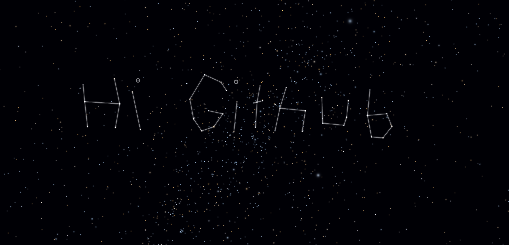
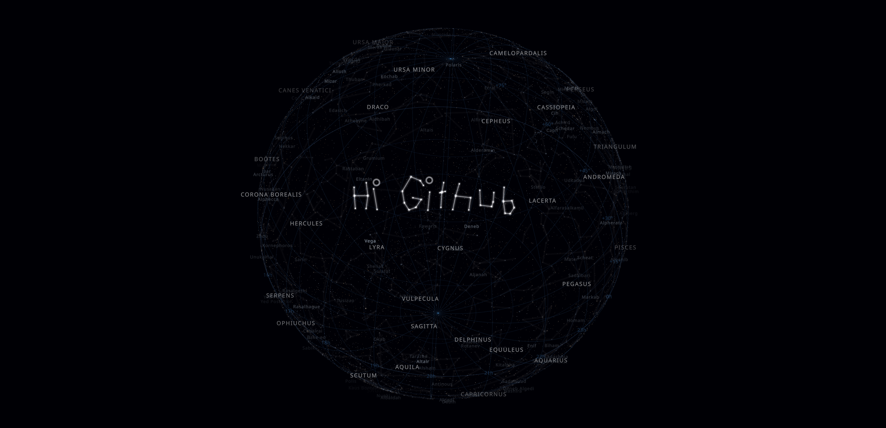

# Written in the Stars

**[starspelled.com](https://starspelled.com)**

Turn words and short phrases into constellations made from real cataloged stars. The matcher works against roughly 9,000 stars from the HYG catalog and uses actual sky positions throughout. No invented points, no hand-placed examples.

<p align="center">
  
</p>
<p align="center">
  <a href="https://starspelled.com/#SGkgR2l0aHVi~Yo4UWAvFbDOcPzLVQrgsQcRog8xeQtSWBucARH2pSdfEGqc15W_HVQf7exEYFX6YVXw5VyL4RjJcuTiUQUGyPoAwxzvBuym1mzA">Open the live "Hi Github" example</a>
</p>
<p align="center">
  
</p>

## How it works

Text is converted into a graph using Hershey Simplex vector data. The matcher then:

- runs a coarse sky search in equirectangular space
- reprojects promising regions onto a gnomonic tangent plane to avoid projection distortion
- refines the fit with CMA-ES
- assigns unique stars to each glyph node with greedy matching plus swap refinement

The result is rendered on an interactive 3D celestial sphere. You can orbit, zoom, and inspect the surrounding sky, then share the exact result through an encoded URL.

See [docs/how-it-works.md](docs/how-it-works.md) for a concise technical walkthrough.

## Practical limits

- The UI currently caps input at 30 characters.
- Short phrases usually resolve quickly in the browser; longer or denser phrases can take much longer and may time out.
- Matching is deterministic for the same input text and star catalog.

## Example

- Live example: [`HI GITHUB`](https://starspelled.com/#SGkgR2l0aHVi~Yo4UWAvFbDOcPzLVQrgsQcRog8xeQtSWBucARH2pSdfEGqc15W_HVQf7exEYFX6YVXw5VyL4RjJcuTiUQUGyPoAwxzvBuym1mzA)

## Features

- Real stars from the HYG Database (Hipparcos, Yale, Gliese)
- Interactive 3D star field with orbit controls
- IAU constellation overlay (87 of 88 official constellations)
- Shareable URLs where every result is encoded in the link
- Shooting star animations and ambient sky cycling
- Re-roll to find alternate placements
- Mobile-friendly with touch controls
- Keyboard shortcuts (`/` to search, `Escape` to dismiss)

## Tech

- **SvelteKit** with static adapter
- **Three.js** for the 3D celestial sphere
- **Web Workers** for off-thread star matching
- **CMA-ES** optimizer with RANSAC-style candidate generation
- **Greedy + swap refinement** with a KD-tree for unique star assignment

## Development

```bash
npm install
npm run dev
```

### Scripts

- `npm run dev` - dev server
- `npm run check` - Svelte and TypeScript checks
- `npm run test` - matcher and sharing tests
- `npm run build` - production build
- `npm run fetch-stars` - regenerate the star catalog from source
- `npm run generate-og` - regenerate the Open Graph image

## Credits

Star data from the [HYG Database](https://github.com/astronexus/HYG-Database) (Hipparcos, Yale Bright Star Catalog, Gliese). Font geometry from the [Hershey Simplex](https://paulbourke.net/dataformats/hershey/) vector font. Inspired by [neal.fun/constellation-draw](https://neal.fun/constellation-draw/).
