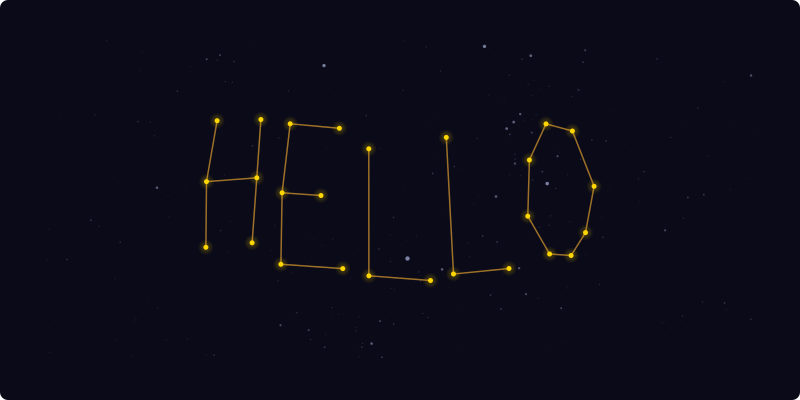
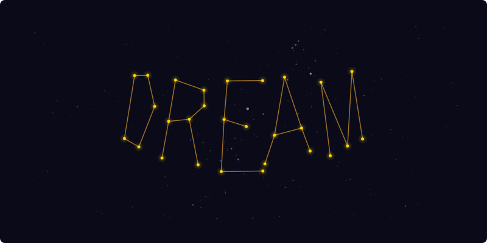

# Written in the Stars

**[starspelled.com](https://starspelled.com)**

Type any word or phrase and discover real stars in the night sky whose positions spell out your message. Every constellation is made from actual cataloged stars — no fakes, no approximations. With ~9,000 stars and enough degrees of freedom, anything can be written in the stars.

<p align="center">
  
</p>
<p align="center">
  
</p>

## How it works

Text is converted into constellation-style graphs using vector font data (Hershey Simplex). A matching engine then searches the entire sky to find the region where real star positions best align with the letterforms. The search combines a coarse spatial grid, RANSAC-style geometric sampling, CMA-ES optimization, and Hungarian optimal assignment to produce clean, readable results — typically in under two seconds.

The result is rendered on an interactive 3D celestial sphere. You can orbit, zoom, and explore the sky around your constellation. Each result is encoded into a shareable URL so you can send your star-spelled message to anyone.

## Features

- Real stars from the HYG Database (Hipparcos, Yale, Gliese)
- Interactive 3D star field with orbit controls
- IAU constellation overlay (88 official constellations)
- Shareable URLs — every result is encoded in the link
- Shooting star animations and ambient sky cycling
- Re-roll to find alternate placements
- Mobile-friendly with touch controls
- Keyboard shortcuts (/ to search, Escape to dismiss)

## Tech

- **SvelteKit** with static adapter
- **Three.js** for the 3D celestial sphere
- **Web Workers** for off-thread star matching
- **CMA-ES** optimizer with RANSAC candidate generation
- **Hungarian algorithm** for optimal star assignment

## Development

```
npm install
npm run dev
```

### Scripts

- `npm run dev` — dev server
- `npm run build` — production build
- `npm run fetch-stars` — regenerate star catalog from source
- `npm run generate-og` — regenerate Open Graph image

## Credits

Star data from the [HYG Database](https://github.com/astronexus/HYG-Database) (Hipparcos, Yale Bright Star Catalog, Gliese). Font geometry from the [Hershey Simplex](https://paulbourke.net/dataformats/hershey/) vector font. Inspired by [neal.fun/constellation-draw](https://neal.fun/constellation-draw/).
